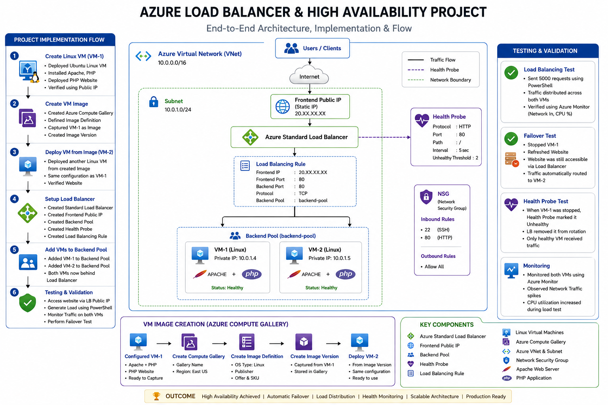

# Azure Load Balancer & High Availability Infrastructure

Production-ready Azure High Availability Infrastructure using Azure Load Balancer, Linux Virtual Machines, Health Probes, Backend Pools, and Azure Compute Gallery with failover testing, traffic distribution, and real-world load balancing implementation.

---

# Architecture Diagram



---

# Project Overview

This project demonstrates the implementation of a highly available web application infrastructure on Microsoft Azure using Azure Virtual Machines, Azure Compute Gallery, and Azure Standard Load Balancer.

The objective of this project was to simulate a real-world production environment where traffic is distributed across multiple backend servers while maintaining high availability and fault tolerance.

The project includes:
- Linux web server deployment
- VM image creation using Azure Compute Gallery
- Multi-VM backend infrastructure
- Azure Standard Load Balancer configuration
- Health probe setup
- Traffic simulation & load testing
- Failover validation
- Infrastructure monitoring

---

# Technologies Used

| Technology | Purpose |
|---|---|
| Microsoft Azure | Cloud Platform |
| Azure Virtual Machines | Backend Web Servers |
| Ubuntu Linux | Operating System |
| Apache2 | Web Server |
| PHP | Website Hosting |
| Azure Load Balancer | Traffic Distribution |
| Azure Compute Gallery | VM Image Management |
| Azure Health Probes | Backend Health Monitoring |
| Azure NSG | Security Rules |
| PowerShell | Load Testing |
| Azure Monitor | Monitoring & Metrics |

---

# Infrastructure Components

- Azure Standard Load Balancer
- Linux Virtual Machines
- Azure Virtual Network (VNet)
- Backend Pool
- Frontend Public IP
- Health Probes
- Network Security Groups (NSG)
- Azure Compute Gallery
- Apache Web Server
- PHP Web Application

---

# Implementation Process

## 1. Linux VM Deployment

Initially deployed a Linux Virtual Machine on Azure and configured the web server environment manually.

Installed:
- Apache2
- PHP
- Website files

Commands used:

```bash
sudo apt update
sudo apt install apache2 php -y
```

After configuration, the website was accessible publicly using the VM Public IP.

---

# 2. VM Image Creation

To avoid repeating manual server configuration, a reusable VM image was created using Azure Compute Gallery.

Configured:
- Azure Compute Gallery
- Image Definition
- Image Version

Benefits:
- Faster deployment
- Standardized infrastructure
- Consistent server configuration
- Easy scaling

---

# 3. Additional VM Deployment

Deployed another Linux VM directly from the captured image.

Both backend servers contained:
- Same Apache configuration
- Same PHP application
- Same runtime environment

This replicated a scalable production-style architecture.

---

# 4. Azure Load Balancer Setup

Configured Azure Standard Load Balancer with:
- Frontend Public IP
- Backend Pool
- Health Probe
- Load Balancing Rule

---

# 5. Backend Pool Configuration

Added both Linux Virtual Machines into the backend pool.

This enabled:
- Automatic traffic distribution
- Health monitoring
- Failover handling
- High availability

---

# 6. Health Probe Configuration

Configured HTTP Health Probe on:

- Port 80

Purpose:
- Detect unhealthy backend VMs
- Remove failed instances automatically
- Route traffic only to healthy servers

---

# Load Balancing Rule

| Configuration | Value |
|---|---|
| Protocol | TCP |
| Frontend Port | 80 |
| Backend Port | 80 |
| Health Probe | HTTP |
| SKU | Standard |

---

# Traffic Simulation & Load Testing

Used PowerShell to generate traffic and validate request distribution.

## PowerShell Script

```powershell
1..5000 | % { Start-Job { Invoke-WebRequest http://LOADBALANCER-IP } }
```

Observed using Azure Monitor:
- Network traffic spikes
- CPU utilization increase
- Successful traffic handling across backend servers

---

# Failover Testing

One of the major objectives of this project was validating high availability and failover functionality.

## Test Scenario

- Website accessed using Load Balancer Public IP
- One backend VM was stopped manually
- Website refreshed multiple times

## Result

The website continued working successfully without downtime.

Azure Load Balancer automatically redirected traffic to the healthy backend VM.

This validated:
- Health probe functionality
- Automatic failover
- Backend redundancy
- Production-grade availability

---

# Challenges Faced & Solutions

| Challenge | Solution |
|---|---|
| Website inaccessible publicly | Configured NSG inbound rule for Port 80 |
| VM image deployment confusion | Used Azure Compute Gallery properly |
| Existing Public IP not attachable to LB | Created dedicated frontend Public IP |
| Backend VM not visible in pool | Ensured same VNet & region |
| Health probe failing | Corrected HTTP probe configuration |
| Needed to verify real load balancing | Performed failover testing |
| PowerShell command failed in CMD | Executed command inside PowerShell |

---

# Monitoring & Validation

Used Azure Monitor to validate:
- CPU utilization
- Network traffic
- Availability metrics
- Health probe functionality

Successfully observed:
- Traffic spikes during load testing
- Backend failover behavior
- Stable service availability

---

# Skills Demonstrated

- Azure Load Balancer
- High Availability Architecture
- Azure Networking
- Azure Virtual Machines
- NSG Configuration
- Backend Pool Management
- Health Probe Configuration
- Infrastructure Troubleshooting
- Linux Server Administration
- VM Image Management
- Load Testing
- Failover Testing
- Cloud Monitoring

---

# Project Outcome

Successfully implemented a highly available Azure web infrastructure capable of:

- Distributing traffic across multiple backend servers
- Detecting unhealthy VM instances automatically
- Maintaining uptime during server failure
- Supporting scalable cloud architecture
- Performing production-style failover handling

This project provided hands-on experience with real-world Azure infrastructure, networking, resiliency, and cloud operations practices.

---

# Author

## Amit Kumar

### GitHub
https://github.com/Akamitt009

### LinkedIn
https://www.linkedin.com/in/amit-kumar-657255232/
