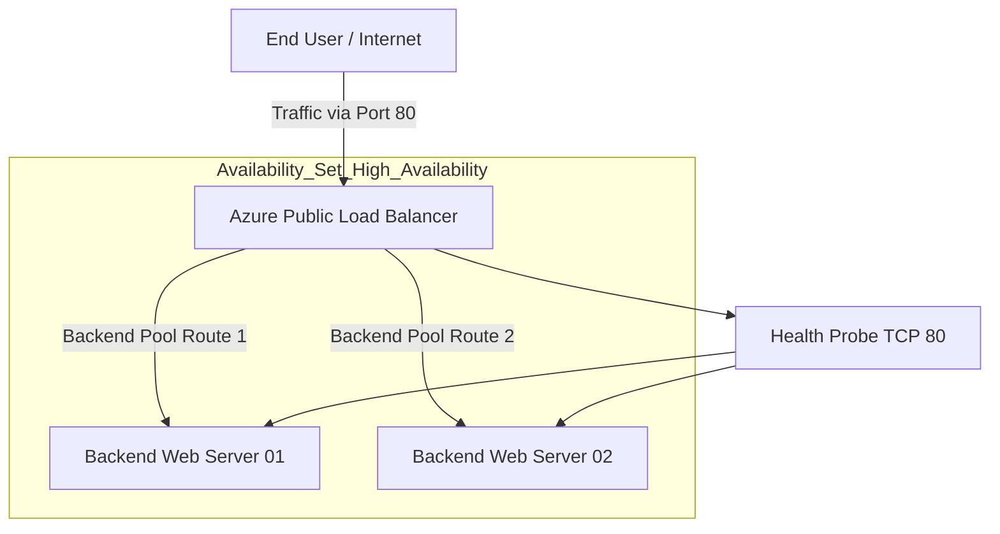

# 🌐 Azure Load Balancer & High Availability Infrastructure


Production-grade Azure High Availability Infrastructure implementing Azure Load Balancer, Health Probes, Backend Pools, Availability Sets, Traffic Distribution, Failover Validation and Enterprise Networking Design.

---

# 📌 Project Overview

This project demonstrates enterprise-grade Azure networking implementation focused on building highly available backend infrastructure capable of automatic traffic distribution and failover handling.

Implemented capabilities:

✅ Azure Standard Load Balancer

✅ Backend Pool Architecture

✅ Health Probe Validation

✅ Multi VM Infrastructure

✅ Automatic Failover

✅ Availability Set Deployment

✅ Azure Compute Gallery

✅ Production-grade Availability Design

---

# 🎯 Business Requirement

Enterprise applications require:

❌ Zero Single Point Of Failure

❌ Traffic Distribution

❌ Backend Redundancy

❌ Automatic Recovery

❌ Infrastructure Availability

❌ Production-grade Reliability

This project solves those problems using Azure networking and high availability principles.

---

# 🏗️ Architecture Design



---

# ⚙️ Core Components Implemented

### 🌐 Frontend IP Configuration

Public IP mapped with Azure Load Balancer for incoming traffic.

---

### 🎯 Backend Pool

Collection of backend Virtual Machines responsible for serving application traffic.

Implemented:

✅ Availability Set

✅ Backend Redundancy

✅ Fault Domain Isolation

✅ Update Domain Protection

---

### 🔍 Health Probes

Configured:

TCP Port 80

Capabilities:

✅ Backend Validation

✅ Health Monitoring

✅ Automatic Traffic Rerouting

✅ Unhealthy VM Removal

---

### ⚖️ Load Balancing Rules

Configured:

Frontend → Backend Port Mapping

Capabilities:

✅ Traffic Distribution

✅ Availability Protection

✅ High Availability

---

# ⚙️ Configuration Variables

Modify deployment behavior using:

variables.tf

| Variable Name | Description | Default Value |
| :--- | :--- | :--- |
| resource_group_name | Azure Resource Group Name | azure-lb-ha-rg |
| location | Azure Region | East US |
| vm_count | Backend VM Count | 2 |
| vm_size | Azure VM SKU | Standard_B1s |

---

# ⚙️ Technology Stack

| Technology | Purpose |
|---|---|
| Azure | Cloud Platform |
| Azure VM | Backend Infrastructure |
| Ubuntu Linux | Operating System |
| Apache2 | Web Layer |
| PHP | Application Runtime |
| Azure Load Balancer | Traffic Distribution |
| Azure Compute Gallery | VM Image Standardization |
| Azure Health Probe | Backend Monitoring |
| NSG | Security Rules |
| PowerShell | Traffic Testing |
| Azure Monitor | Monitoring |

---

# 🚀 Infrastructure Components

✅ Azure Standard Load Balancer

✅ Backend Pool

✅ Frontend Public IP

✅ Health Probe

✅ Availability Set

✅ Azure Monitor

✅ Compute Gallery

✅ NSG Rules

---

# 🚀 Deployment Process

## 1️⃣ Linux VM Deployment

Installed:

```bash
sudo apt update

sudo apt install apache2 php -y
```

Configured:

- Apache
- PHP
- Website Files

---

## 2️⃣ Azure Compute Gallery

Created:

- Image Definition

- Image Version

Benefits:

✅ Faster Provisioning

✅ Standardization

✅ Repeatable Infrastructure

---

## 3️⃣ Secondary VM Deployment

Provisioned second backend VM.

Validated:

✅ Same Runtime

✅ Same Application

✅ Same Configuration

---

## 4️⃣ Load Balancer Configuration

Configured:

- Frontend IP

- Backend Pool

- Health Probe

- Load Balancing Rule

---

## 5️⃣ Backend Pool Configuration

Added backend servers.

Capabilities:

✅ Traffic Distribution

✅ Backend Redundancy

✅ Failover Protection

---

## 6️⃣ Health Probe Validation

Configured:

TCP Port 80

Validated:

✅ VM Health Validation

✅ Backend Monitoring

✅ Automatic Failover

---

# 📈 Load Balancing Configuration

| Configuration | Value |
| :--- | :--- |
| Protocol | TCP |
| Frontend Port | 80 |
| Backend Port | 80 |
| Probe Type | TCP |
| Probe Port | 80 |
| SKU | Standard |

---

# 🚦 Traffic Simulation & Load Testing

PowerShell Validation:

```powershell
1..5000 | % { Start-Job { Invoke-WebRequest http://LOADBALANCER-IP } }
```

Observed:

✅ CPU Increase

✅ Traffic Distribution

✅ Backend Balancing

✅ Stable Availability

---

# 🔥 Failover Testing

Scenario:

1. Website opened through LB Public IP

2. Backend VM manually stopped

3. Traffic behavior validated

Result:

✅ Zero Downtime

✅ Automatic Traffic Redirection

✅ Health Probe Operational

✅ Backend Redundancy Working

---

# ⚠️ Engineering Challenges Solved

| Challenge | Solution |
|---|---|
| Website inaccessible | NSG Rule Configuration |
| VM deployment standardization | Compute Gallery |
| Public IP limitation | Dedicated Frontend IP |
| VM not visible in pool | Network Validation |
| Health Probe failed | TCP Probe Fix |
| Needed balancing proof | PowerShell Traffic Testing |

---

# 📸 Project Proof Screenshots

## Architecture


---

## Monitoring


---

## Failover Validation


---

## Load Balancer Configuration


---

# 📊 Monitoring & Validation

Validated:

✅ Traffic Distribution

✅ CPU Utilization

✅ Health Probe Behavior

✅ Backend Availability

✅ Failover Validation

Using:

Azure Monitor

---

# 🧠 Skills Demonstrated

Azure Load Balancer

Azure Networking

High Availability Architecture

Backend Pool Management

Health Probe Configuration

Azure Virtual Machines

Traffic Distribution

Failover Testing

Linux Administration

Azure Monitoring

Cloud Operations

---

# 📈 Project Outcome

Successfully implemented highly available Azure backend infrastructure supporting:

✅ Traffic Distribution

✅ Automatic Failover

✅ Backend Redundancy

✅ Production-grade Availability

✅ Infrastructure Reliability

---

# 👨‍💻 Author

## Amit Kumar

Cloud Engineer | Azure Administrator | Infrastructure Engineer

GitHub

https://github.com/Akamitt009

LinkedIn

https://www.linkedin.com/in/amit-kumar-657255232/
