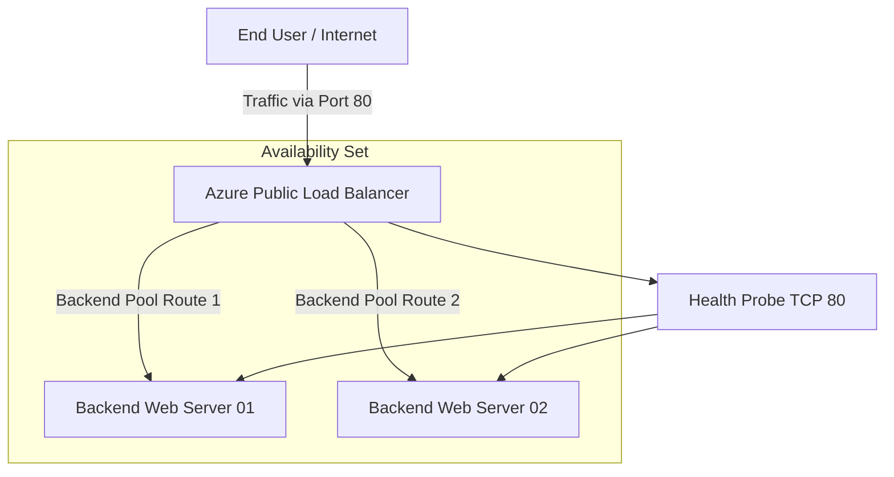

# 🌐 Azure Load Balancer & High Availability Infrastructure


Production-grade Azure High Availability Infrastructure implementing Azure Load Balancer, Backend Pools, Health Probes, Availability Sets, Failover Validation, Traffic Distribution and Enterprise Networking Architecture.

---

# 📌 Project Overview

This project demonstrates implementation of enterprise-grade Azure High Availability infrastructure using:

✅ Azure Standard Load Balancer

✅ Multi VM Backend Infrastructure

✅ Health Probe Monitoring

✅ Availability Set Architecture

✅ Automatic Traffic Distribution

✅ Production-grade Failover Validation

✅ Backend Redundancy

✅ Infrastructure Monitoring

---

# 🎯 Business Requirement

Modern cloud infrastructure requires:

❌ Zero single point of failure

❌ Backend redundancy

❌ Automatic failover

❌ Traffic distribution

❌ Infrastructure resiliency

❌ Availability validation

This project solves those challenges using Azure cloud networking principles.

---

# 🏗️ Architecture Design



---

# ⚙️ Core Components Implemented

### 🌐 Frontend IP Configuration

Public IP associated with Azure Standard Load Balancer for external traffic ingress.

---

### 🎯 Backend Pool

Multiple Linux Virtual Machines grouped together for traffic distribution.

Configured inside:

✅ Availability Set

✅ Fault Domain Isolation

✅ Update Domain Protection

---

### 🔍 Health Probes

Configured:

TCP Port 80 Monitoring

Capabilities:

✅ Automatic VM validation

✅ Backend health monitoring

✅ Unhealthy instance removal

✅ Automatic rerouting

---

### ⚖️ Load Balancing Rules

Configured:

Frontend Port → Backend Port Mapping

Capabilities:

✅ Even traffic distribution

✅ Backend redundancy

✅ High availability

---

# ⚙️ Configuration Variables

Modify deployment behavior using:

variables.tf

| Variable Name | Description | Default Value |
| :--- | :--- | :--- |
| resource_group_name | Azure Resource Group | azure-lb-ha-rg |
| location | Azure Region | East US |
| vm_count | Backend VM Count | 2 |
| vm_size | Azure VM SKU | Standard_B1s |

---

# ⚙️ Technology Stack

| Technology | Purpose |
|---|---|
| Microsoft Azure | Cloud Platform |
| Azure VM | Backend Servers |
| Ubuntu Linux | Operating System |
| Apache2 | Web Layer |
| PHP | Application Runtime |
| Azure Load Balancer | Traffic Distribution |
| Azure Compute Gallery | VM Image Standardization |
| Azure Health Probe | Backend Monitoring |
| NSG | Network Security |
| PowerShell | Traffic Simulation |
| Azure Monitor | Monitoring |

---

# 🚀 Infrastructure Components

✅ Azure Standard Load Balancer

✅ Frontend Public IP

✅ Backend Pool

✅ Availability Set

✅ Health Probe

✅ Azure Compute Gallery

✅ Linux VM Infrastructure

✅ Azure Monitor

✅ NSG Rules

---

# 📂 Project Structure

```text

azure-load-balancer-high-availability/

├── images/

│ ├── architecture-diagram.png

│ ├── monitoring.png

│ ├── failover-testing.png

│ └── load-balancer-config.png

├── README.md

```

---

# 🚀 Deployment Process

## 1️⃣ Linux VM Deployment

Created Linux VM.

Installed:

```bash
sudo apt update

sudo apt install apache2 php -y
```

Configured:

✅ Apache

✅ PHP

✅ Website Files

---

## 2️⃣ Azure Compute Gallery

Created:

- Image Definition

- Image Version

Benefits:

✅ Standardized deployment

✅ Faster provisioning

✅ Consistency

---

## 3️⃣ Backend VM Scaling

Provisioned secondary VM.

Validated:

✅ Same runtime environment

✅ Same web application

✅ Same backend configuration

---

## 4️⃣ Load Balancer Configuration

Configured:

- Frontend Public IP

- Backend Pool

- Health Probe

- Load Balancing Rule

---

## 5️⃣ Health Probe Validation

Configured:

TCP Port 80

Validated:

✅ Health monitoring

✅ Automatic failover

✅ Backend availability

---

# 📈 Load Balancing Configuration

| Configuration | Value |
| :--- | :--- |
| Protocol | TCP |
| Frontend Port | 80 |
| Backend Port | 80 |
| Probe Type | TCP |
| Probe Port | 80 |
| SKU | Standard |

---

# 🚦 Traffic Simulation & Load Testing

PowerShell Validation:

```powershell
1..5000 | % { Start-Job { Invoke-WebRequest http://LOADBALANCER-IP } }
```

Observed:

✅ CPU spike

✅ Traffic distribution

✅ Backend balancing

✅ Stable availability

---

# 🔥 Failover Testing

Scenario:

1. Website opened using LB Public IP

2. Backend VM stopped manually

3. Multiple refresh validation

Result:

✅ Website remained online

✅ Automatic traffic reroute

✅ Health probe validation

✅ Backend redundancy operational

---

# ⚠️ Engineering Challenges Solved

| Challenge | Solution |
|---|---|
| Website inaccessible | NSG inbound rule |
| VM image confusion | Azure Compute Gallery |
| Public IP issue | Dedicated frontend IP |
| VM not visible in pool | Same VNet validation |
| Health Probe failed | TCP Probe correction |
| Load balancing validation | PowerShell traffic generation |

---

# 📸 Project Proof Screenshots

## Architecture


---

## Load Testing


---

## Failover Validation


---

## Load Balancer Configuration


---

# 📊 Monitoring & Validation

Validated:

✅ CPU Utilization

✅ Backend Health

✅ Traffic Distribution

✅ Availability Metrics

✅ Failover Behavior

Using:

Azure Monitor

---

# 🧠 Skills Demonstrated

Azure Load Balancer

Azure Networking

High Availability Architecture

Backend Pool Management

Health Probe Configuration

Azure VM

NSG Rules

Linux Administration

Traffic Distribution

Failover Validation

Cloud Monitoring

Azure Compute Gallery

---

# 📈 Project Outcome

Successfully implemented enterprise-grade Azure High Availability Infrastructure supporting:

✅ Automatic Failover

✅ Traffic Distribution

✅ Backend Redundancy

✅ Production-grade Availability

✅ Health Validation

✅ Scalable Cloud Architecture

---

# 👨‍💻 Author

## Amit Kumar

Cloud Engineer | Azure Administrator | Infrastructure Engineer

GitHub

https://github.com/Akamitt009

LinkedIn

https://www.linkedin.com/in/amit-kumar-657255232/
